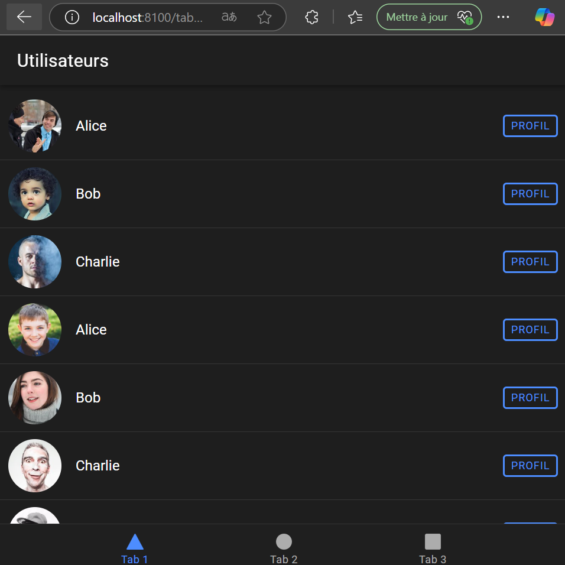
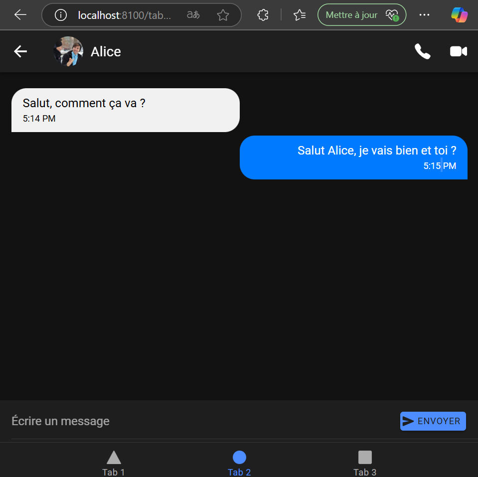
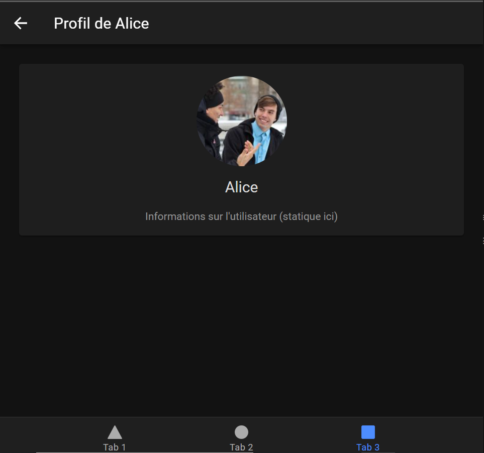

# 📱 ChatApp - Ionic Angular + Capacitor

Bienvenue dans **ChatApp**, une application de chat développée avec **Ionic**, **Angular**, et déployable sur **Android** grâce à **Capacitor**.

## 📂 Structure du projet

```bash
├── android/            # Projet Android généré par Capacitor
├── node_modules/       # Dépendances du projet
├── resources/          # Icônes et splash screens
├── src/
│   └── app/
│       ├── explore-container/
│       ├── pages/
│       │   ├── chat-room/
│       │   ├── user-list/
│       │   └── user-profile/
│       ├── services/
│       │   └── chat.service.ts
│       ├── tab1/
│       ├── tab2/
│       ├── tab3/
│       └── tabs/
│       ├── app-routing.module.ts
│       ├── app.component.ts / .html / .scss / .spec.ts
│       └── app.module.ts
├── assets/
```

---

## ✨ Fonctionnalités principales

- 🔹 Liste des utilisateurs
- 🔹 Ouverture d'une conversation privée
- 🔹 Envoi et réception de messages
- 🔹 Visualisation du profil d'un utilisateur
- 🔹 Design moderne avec **Ionic Components**

---

## 🔥 Interfaces principales

### **User**
```typescript
export interface User {
  id: number;
  name: string;
  avatar: string;
}
```

### **Message**
```typescript
export interface Message {
  senderId: number;
  receiverId: number;
  content: string;
  timestamp: Date;
}
```

---

## 🚀 Lancer l'application en local

### 1. Installer les dépendances
```bash
npm install
```

### 2. Démarrer le serveur de développement
```bash
ionic serve
```
Cela va ouvrir automatiquement ton app dans le navigateur.

---

## 📲 Déployer sur Android avec Capacitor

### 1. Ajouter Capacitor
Si ce n’est pas encore fait :
```bash
npm install @capacitor/core @capacitor/cli
npx cap init
```
Configure `appName` et `appId` (ex: `com.example.chatapp`).

### 2. Ajouter la plateforme Android
```bash
npx cap add android
```

### 3. Synchroniser le projet
Chaque fois que tu fais des changements :
```bash
npx cap sync
```

### 4. Ouvrir le projet dans Android Studio
```bash
npx cap open android
```
👉 Compile et exécute ton app sur un émulateur ou un vrai téléphone.

---

## 📦 Commandes utiles

| Action                           | Commande                         |
|---------------------------------- |---------------------------------- |
| Lancer en local                  | `ionic serve`                    |
| Build production                 | `ionic build --prod`             |
| Ajouter Android                  | `npx cap add android`            |
| Synchroniser avec Capacitor      | `npx cap sync`                   |
| Ouvrir Android Studio            | `npx cap open android`           |
| Générer icônes et splash screens | `npx capacitor-assets generate`  |

---

## ⚙️ Capacitor Configuration

Dans `capacitor.config.ts` :

```typescript
const config: CapacitorConfig = {
  appId: 'com.example.chatapp',
  appName: 'ChatApp',
  webDir: 'www',
  bundledWebRuntime: false
};
```

---

## 🔥 Captures d'écran
### liste des utilisateurs: 

<p align="center">
  
</p>

### Room: 

<p align="center">
  
</p

### Profile de l'utilisateur: 

<p align="center">
  
</p

---

## 📜 Remarques

- Cette version utilise des **données statiques** (utilisateurs et messages) via le service `ChatService`.
- Pour une vraie application, tu pourras connecter ton app à une API externe, une base Firebase ou ton propre backend.
